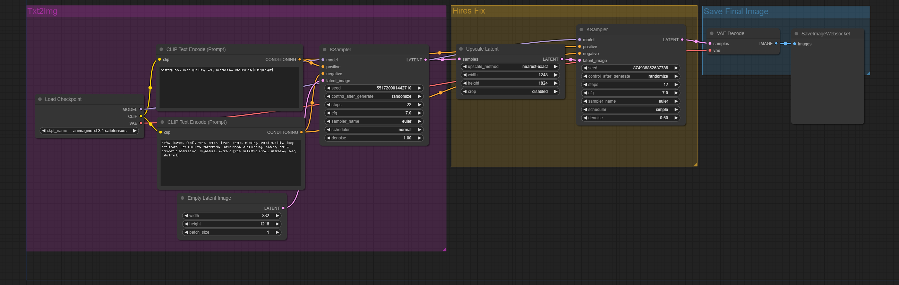

# Animagine XL 3.1 Basic

## LandScape(3:2 [1824 x 1248])


## Portait(2:3 [1248 x 1824])


## Setup
```bash
cd ComfyUI
pip install -r requirements.txt
pip install websocket-client

cd models/checkpoints
wget https://huggingface.co/cagliostrolab/animagine-xl-3.1/resolve/main/animagine-xl-3.1.safetensors
```

## Example
### LandScape
```bash
time python websockets_api.py --mode 1 --prompt "Hatsune Miku" --save_path "./test.png"
```
```
NVIDIA L4
real    0m31.758s
user    0m1.742s
sys     0m0.032s
```

### Portait
```bash
time python websockets_api.py --mode 2 --prompt "Hatsune Miku" --save_path "./test.png"
```
```
NVIDIA L4
real    0m32.831s
user    0m1.760s
sys     0m0.036s
```


